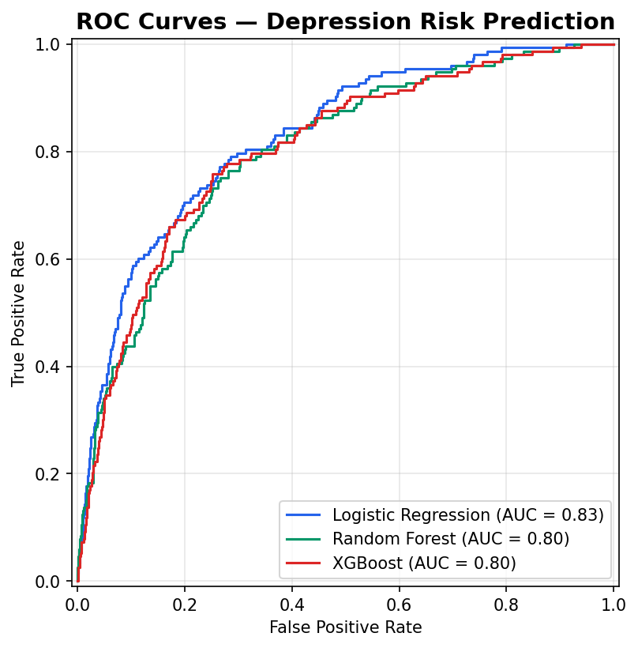
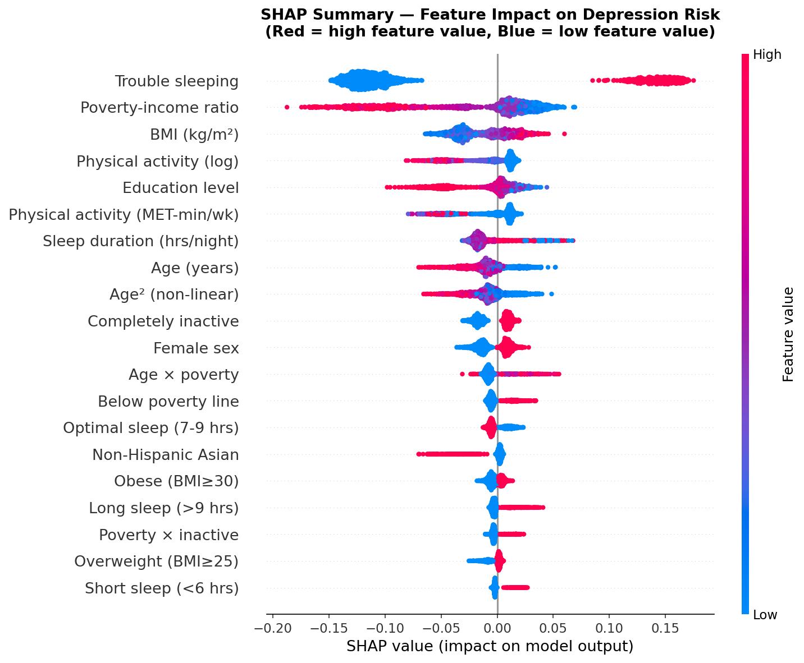

# Open Health Risk Engine

Open Health Risk Engine is an end-to-end data science portfolio project that uses public NHANES 2017-March 2020 pre-pandemic survey data to estimate depression risk from lifestyle and demographic variables. It includes a reproducible data pipeline, model comparison, SHAP-based explainability, automated tests, and a Streamlit interface for interactive scoring.

## What This Project Does

- Downloads public NHANES survey files from the CDC
- Cleans and merges lifestyle, sleep, BMI, alcohol, and demographic variables
- Engineers interpretable features for mental health risk modeling
- Trains Logistic Regression, Random Forest, and XGBoost classifiers
- Selects a best model for deployment and surfaces feature importance and SHAP explanations
- Serves the final model through a Streamlit app designed for portfolio demos

## Model Snapshot

The current trained demo model uses **NHANES 2017-March 2020 pre-pandemic data** and selects **Random Forest** as the deployment model for its balance of performance and interpretability.

| Model | Test AUC-ROC | Test F1 | Precision | Recall |
| --- | ---: | ---: | ---: | ---: |
| Logistic Regression | 0.7811 | 0.3242 | 0.2110 | 0.6993 |
| Random Forest | 0.7591 | 0.3295 | 0.2331 | 0.5621 |
| XGBoost | 0.7438 | 0.2518 | 0.2800 | 0.2288 |

## Demo Assets





## Project Structure

```text
open-health-risk-engine/
├── app.py
├── dashboard/app.py
├── explainability/shap_analysis.py
├── src/download_data.py
├── src/data_cleaning.py
├── src/feature_engineering.py
├── src/train_model.py
├── src/predict_risk.py
├── tests/test_pipeline.py
├── models/
├── figures/
└── data/
```

## Local Setup

```powershell
py -3 -m venv .venv
py -3 -m pip --python .\.venv\Scripts\python.exe install -r requirements.txt
```

## Run The Full Pipeline

```powershell
.\.venv\Scripts\python.exe src\download_data.py
.\.venv\Scripts\python.exe src\data_cleaning.py
.\.venv\Scripts\python.exe src\feature_engineering.py
.\.venv\Scripts\python.exe src\train_model.py
.\.venv\Scripts\python.exe explainability\shap_analysis.py
```

## Run Tests

```powershell
.\.venv\Scripts\python.exe -m pytest tests -q
```

## Launch The App

```powershell
.\.venv\Scripts\python.exe -m streamlit run app.py
```

## Deployment Notes

- GitHub repository URL: https://github.com/andyombogo/open-health-risk-engine
- Hugging Face Space URL: https://huggingface.co/spaces/andyombogo/open-health-risk-engine
- Fastest live app URL: https://andyombogo-open-health-risk-engine.hf.space
- The app is packaged for Hugging Face Spaces using the `docker` SDK because Hugging Face deprecated Streamlit as the default built-in SDK in 2025.

## Important Disclaimer

This is a research and portfolio demo, not a diagnostic or clinical decision tool. Predictions are based on population-level survey data and do not replace professional medical evaluation.
